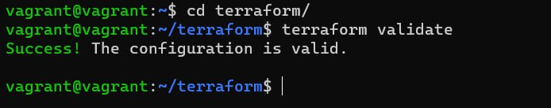
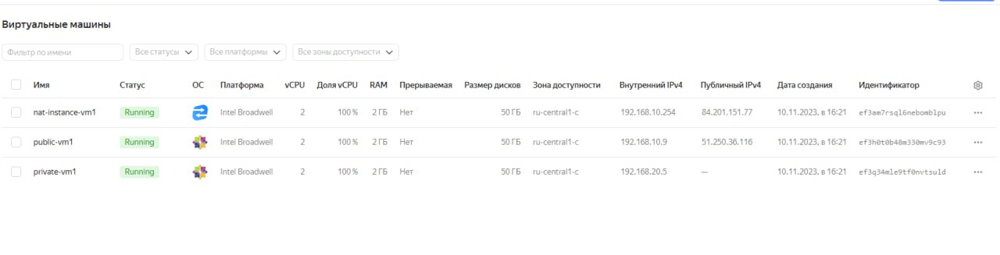
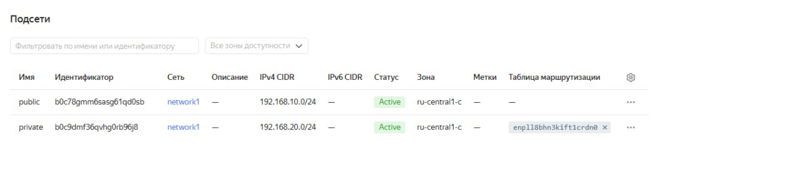

# Домашнее задание к занятию «Организация сети»

### Подготовка к выполнению задания

1. Домашнее задание состоит из обязательной части, которую нужно выполнить на провайдере Yandex Cloud, и дополнительной части в AWS (выполняется по желанию). 
2. Все домашние задания в блоке 15 связаны друг с другом и в конце представляют пример законченной инфраструктуры.  
3. Все задания нужно выполнить с помощью Terraform. Результатом выполненного домашнего задания будет код в репозитории. 
4. Перед началом работы настройте доступ к облачным ресурсам из Terraform, используя материалы прошлых лекций и домашнее задание по теме «Облачные провайдеры и синтаксис Terraform». Заранее выберите регион (в случае AWS) и зону.

---
### Задание 1. Yandex Cloud 

**Что нужно сделать**

1. Создать пустую VPC. Выбрать зону.
2. Публичная подсеть.

 - Создать в VPC subnet с названием public, сетью 192.168.10.0/24.
 - Создать в этой подсети NAT-инстанс, присвоив ему адрес 192.168.10.254. В качестве image_id использовать fd80mrhj8fl2oe87o4e1.
 - Создать в этой публичной подсети виртуалку с публичным IP, подключиться к ней и убедиться, что есть доступ к интернету.
3. Приватная подсеть.
 - Создать в VPC subnet с названием private, сетью 192.168.20.0/24.
 - Создать route table. Добавить статический маршрут, направляющий весь исходящий трафик private сети в NAT-инстанс.
 - Создать в этой приватной подсети виртуалку с внутренним IP, подключиться к ней через виртуалку, созданную ранее, и убедиться, что есть доступ к интернету.

Resource Terraform для Yandex Cloud:

- [VPC subnet](https://registry.terraform.io/providers/yandex-cloud/yandex/latest/docs/resources/vpc_subnet).
- [Route table](https://registry.terraform.io/providers/yandex-cloud/yandex/latest/docs/resources/vpc_route_table).
- [Compute Instance](https://registry.terraform.io/providers/yandex-cloud/yandex/latest/docs/resources/compute_instance).


---

### Решение  

https://github.com/apriemysheva/clopro-homeworks2/tree/main/terraform



```
vagrant@vagrant:~/terraform$ terraform apply -auto-approve
  # yandex_vpc_network.network-1 will be created
  + resource "yandex_vpc_network" "network-1" {
      + created_at                = (known after apply)
      + default_security_group_id = (known after apply)
      + folder_id                 = (known after apply)
      + id                        = (known after apply)
      + labels                    = (known after apply)
      + name                      = "network1"
      + subnet_ids                = (known after apply)
    }

  # yandex_vpc_route_table.nat-route-table will be created
  + resource "yandex_vpc_route_table" "nat-route-table" {
      + created_at = (known after apply)
      + folder_id  = (known after apply)
      + id         = (known after apply)
      + labels     = (known after apply)
      + network_id = (known after apply)

      + static_route {
          + destination_prefix = "0.0.0.0/0"
          + next_hop_address   = "192.168.10.254"
        }
    }

  # yandex_vpc_subnet.subnet-private will be created
  + resource "yandex_vpc_subnet" "subnet-private" {
      + created_at     = (known after apply)
      + folder_id      = (known after apply)
      + id             = (known after apply)
      + labels         = (known after apply)
      + name           = "private"
      + network_id     = (known after apply)
      + route_table_id = (known after apply)
      + v4_cidr_blocks = [
          + "192.168.20.0/24",
        ]
      + v6_cidr_blocks = (known after apply)
      + zone           = "ru-central1-c"
    }

  # yandex_vpc_subnet.subnet-public will be created
  + resource "yandex_vpc_subnet" "subnet-public" {
      + created_at     = (known after apply)
      + folder_id      = (known after apply)
      + id             = (known after apply)
      + labels         = (known after apply)
      + name           = "public"
      + network_id     = (known after apply)
      + v4_cidr_blocks = [
          + "192.168.10.0/24",
        ]
      + v6_cidr_blocks = (known after apply)
      + zone           = "ru-central1-c"
    }

Plan: 7 to add, 0 to change, 0 to destroy.
Changes to Outputs:
  + external_ip_address_nat_vm     = (known after apply)
  + external_ip_address_private_vm = (known after apply)
  + external_ip_address_public_vm  = (known after apply)
  + internal_ip_address_nat_vm     = "192.168.10.254"
  + internal_ip_address_private_vm = (known after apply)
  + internal_ip_address_public_vm  = (known after apply)
yandex_vpc_network.network-1: Creating...
yandex_vpc_network.network-1: Creation complete after 4s [id=enp2mbblc9kg8f9s13sg]
yandex_vpc_subnet.subnet-public: Creating...
yandex_vpc_route_table.nat-route-table: Creating...
yandex_vpc_subnet.subnet-public: Creation complete after 1s [id=b0c78gmm6sasg61qd0sb]
yandex_compute_instance.nat-instance: Creating...
yandex_compute_instance.public-vm: Creating...
yandex_vpc_route_table.nat-route-table: Creation complete after 2s [id=enpll8bhn3kift1crdn0]
yandex_vpc_subnet.subnet-private: Creating...
yandex_vpc_subnet.subnet-private: Creation complete after 1s [id=b0c9dmf36qvhg0rb96j8]
yandex_compute_instance.private-vm: Creating...
yandex_compute_instance.nat-instance: Still creating... [10s elapsed]
yandex_compute_instance.public-vm: Still creating... [10s elapsed]
yandex_compute_instance.private-vm: Still creating... [10s elapsed]
yandex_compute_instance.public-vm: Still creating... [20s elapsed]
yandex_compute_instance.nat-instance: Still creating... [20s elapsed]
yandex_compute_instance.private-vm: Still creating... [20s elapsed]
yandex_compute_instance.nat-instance: Still creating... [30s elapsed]
yandex_compute_instance.public-vm: Still creating... [30s elapsed]
yandex_compute_instance.private-vm: Still creating... [30s elapsed]
yandex_compute_instance.public-vm: Creation complete after 34s [id=ef3h0t0b48m330mv9c93]
yandex_compute_instance.nat-instance: Still creating... [40s elapsed]
yandex_compute_instance.private-vm: Still creating... [40s elapsed]
yandex_compute_instance.private-vm: Creation complete after 43s [id=ef3q34mle9tf0nvtsuld]
yandex_compute_instance.nat-instance: Still creating... [50s elapsed]
yandex_compute_instance.nat-instance: Still creating... [1m0s elapsed]
yandex_compute_instance.nat-instance: Creation complete after 1m0s [id=ef3am7rsql6nebomblpu]

Apply complete! Resources: 7 added, 0 changed, 0 destroyed.

Outputs:

external_ip_address_nat_vm = "84.201.151.77"
external_ip_address_private_vm = ""
external_ip_address_public_vm = "51.250.36.116"
internal_ip_address_nat_vm = "192.168.10.254"
internal_ip_address_private_vm = "192.168.20.5"
internal_ip_address_public_vm = "192.168.10.9"
vagrant@vagrant:~/terraform$
```
Файл отработал корректно, создались ВМ и подсети:





Проверяем доступ к интернету c public-vm1:
 ```
vagrant@vagrant:~/terraform$ ssh centos@51.250.36.116
The authenticity of host '51.250.36.116 (51.250.36.116)' can't be established.
ECDSA key fingerprint is SHA256:jWU+McBQKyEHd7xw8jLUS/bhrfb4zKqmaOGNrqEEK6w.
Are you sure you want to continue connecting (yes/no/[fingerprint])? yes
Warning: Permanently added '51.250.36.116' (ECDSA) to the list of known hosts.
[centos@public-vm1 ~]$ ping mail.ru
PING mail.ru (217.69.139.200) 56(84) bytes of data.
64 bytes from mail.ru (217.69.139.200): icmp_seq=1 ttl=55 time=113 ms
64 bytes from mail.ru (217.69.139.200): icmp_seq=2 ttl=55 time=51.8 ms
64 bytes from mail.ru (217.69.139.200): icmp_seq=3 ttl=55 time=79.7 ms
64 bytes from mail.ru (217.69.139.200): icmp_seq=4 ttl=55 time=55.8 ms
^C
--- mail.ru ping statistics ---
4 packets transmitted, 4 received, 0% packet loss, time 3001ms
rtt min/avg/max/mdev = 51.815/75.316/113.767/24.636 ms
[centos@public-vm1 ~]$
```

Проверка с  private-vm1:
``` 
[centos@private-vm1 ~]$ ping mail.ru
PING mail.ru (94.100.180.201) 56(84) bytes of data.
64 bytes from mail.ru (94.100.180.201): icmp_seq=1 ttl=55 time=51.7 ms
64 bytes from mail.ru (94.100.180.201): icmp_seq=2 ttl=55 time=125 ms
64 bytes from mail.ru (94.100.180.201): icmp_seq=3 ttl=55 time=51.1 ms
64 bytes from mail.ru (94.100.180.201): icmp_seq=4 ttl=55 time=51.8 ms
64 bytes from mail.ru (94.100.180.201): icmp_seq=5 ttl=55 time=51.8 ms
64 bytes from mail.ru (94.100.180.201): icmp_seq=6 ttl=55 time=51.9 ms
64 bytes from mail.ru (94.100.180.201): icmp_seq=7 ttl=55 time=51.8 ms
64 bytes from mail.ru (94.100.180.201): icmp_seq=8 ttl=55 time=51.2 ms
^C
--- mail.ru ping statistics ---
8 packets transmitted, 8 received, 0% packet loss, time 7010ms
rtt min/avg/max/mdev = 51.176/60.937/125.851/24.536 ms


```
---
### Задание 2. AWS* (задание со звёздочкой)

Это необязательное задание. Его выполнение не влияет на получение зачёта по домашней работе.

**Что нужно сделать**

1. Создать пустую VPC с подсетью 10.10.0.0/16.
2. Публичная подсеть.

 - Создать в VPC subnet с названием public, сетью 10.10.1.0/24.
 - Разрешить в этой subnet присвоение public IP по-умолчанию.
 - Создать Internet gateway.
 - Добавить в таблицу маршрутизации маршрут, направляющий весь исходящий трафик в Internet gateway.
 - Создать security group с разрешающими правилами на SSH и ICMP. Привязать эту security group на все, создаваемые в этом ДЗ, виртуалки.
 - Создать в этой подсети виртуалку и убедиться, что инстанс имеет публичный IP. Подключиться к ней, убедиться, что есть доступ к интернету.
 - Добавить NAT gateway в public subnet.
3. Приватная подсеть.
 - Создать в VPC subnet с названием private, сетью 10.10.2.0/24.
 - Создать отдельную таблицу маршрутизации и привязать её к private подсети.
 - Добавить Route, направляющий весь исходящий трафик private сети в NAT.
 - Создать виртуалку в приватной сети.
 - Подключиться к ней по SSH по приватному IP через виртуалку, созданную ранее в публичной подсети, и убедиться, что с виртуалки есть выход в интернет.

Resource Terraform:

1. [VPC](https://registry.terraform.io/providers/hashicorp/aws/latest/docs/resources/vpc).
1. [Subnet](https://registry.terraform.io/providers/hashicorp/aws/latest/docs/resources/subnet).
1. [Internet Gateway](https://registry.terraform.io/providers/hashicorp/aws/latest/docs/resources/internet_gateway).

### Правила приёма работы

Домашняя работа оформляется в своём Git репозитории в файле README.md. Выполненное домашнее задание пришлите ссылкой на .md-файл в вашем репозитории.
Файл README.md должен содержать скриншоты вывода необходимых команд, а также скриншоты результатов.
Репозиторий должен содержать тексты манифестов или ссылки на них в файле README.md.
